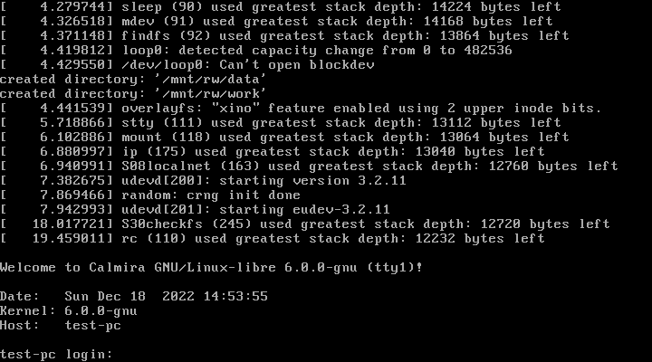
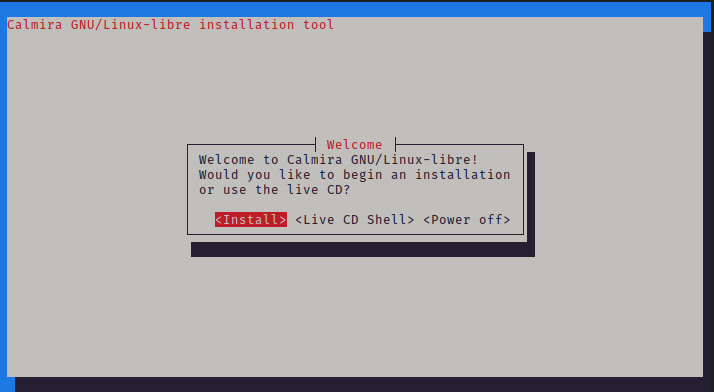

# Установка дистрибутива версии >= 2.Х

Дистрибутив версии 2.0 и выше поставляется с простой в использовании
псевдографической программой установки. В релизах, предшествующих 2.0, такой
программы нет, и вся установка производилась вручную. Кроме того, в этих
релизах не формировались загрузочные iso-образы, а генерировались
squashfs-снимки. Как вы уже поняли, процесс установки старых версий Calmira
GNU/Linux-libre достаточно сложен, поэтому мы специально закончили их
техподдержку после выхода версии 2.0, процесс установки которой сильно упрощён.

Прочтя эту страницу документации, вы узнаете:

- Как дистрибутив видит и делит на разделы жёсткие диски.
- Как запустить `calminstall`.
- Как работать с `calminstall`.

## Системные требования

| Пункт        | Минимальные требования | Рекомендуемые требования      |
| ------------ | ---------------------- | ----------------------------- |
| ЦП           | x86_64 > 900 МГц       | x86_64 1 ГГц                  |
| ОЗУ          | 64 Мб                  | 128 Мб                        |
| Жёсткий диск | HDD 1.5 Гб             | SSD 5 Гб                      |
| Сеть         | --                     | Наличие сетевого адаптера[^1] |

[^1]: в дистрибутиве используется ядро Linux-libre, которое было очищено от несвободных драйверов, прошивок и блобов. Это значит, что некоторое оборудование (как правило, это сетевые, звуковые и видеокарты) в ОС не поддерживаются, т.е. либо не будут определяться в системе вообще, либо просто не будут корректно работать. В том случае, если что-то из вашего оборудования не поддерживается, попробуйте переключиться на обычное ядро Linux с проприетарными несвободными компонентами [оно входит в минимальную поставку дистрибутива; переключиться можно, выбрав в меню загрузчика ОС соответствующий пункт]. Если не помогло и это, то отправьте нам issue об этом на нашем [GitLab](https://gitlab.com/calmiralinux/calmiralinux). Опишите поведение дистрибутива, версии программного обеспечения (ядро Linux-libre и Linux),тип оборудования, с которым возникли проблемы, его модель и прочие подобные сведения.

## Разделы диска для дистрибутива

Диск ПК делится на отдельные части, которые называются _разделами_. Каждая
операционная система определяет разделы своим способом. К примеру, MS-DOS и её
потомки, такие, как Windows, присваивает каждому главному и логическому разделу
_букву диска_, например, **A:**, **B:**, **C:**, **D:** и т.д. А, например,
операционные системы семейства GNU/Linux, именуют диски и разделы так:
`/dev/XdYN`, где `X` и `Y` - определённая буква диска, а `N` - номер раздела на
этом диске. `X` определяет тип диска (`h` - диск IDE, `s` - диск SATA), `y` -
сам диск (`a` - главный диск, `b`, `c`, `d`... - съёмные диски).

К примеру, **sda3** - это третий раздел (`3`) главного жёсткого диска (`a`) типа
SATA (`s`). Таблица ниже поможет определить тип диска

| Тип устройства        | Дескриптор устройства  | Примечания                                                                                                                                                                                                                                                                                                                                                                                                                                                                                                 |
| --------------------- | ---------------------- | ---------------------------------------------------------------------------------------------------------------------------------------------------------------------------------------------------------------------------------------------------------------------------------------------------------------------------------------------------------------------------------------------------------------------------------------------------------------------------------------------------------- |
| SATA, SCSI, USB Flash | `sda`, `sdb`, `sdc`... | Стал доступен где-то в 2007 году и встречается до сих пор. Наверно, на данный момент самый используемый в GNU/Linux тип.                                                                                                                                                                                                                                                                                                                                                                                   |
| NVMe                  | `nvme0n1`              | Передовая технология накопителей. Устройства NVMe подключаются к шине PCI Express и обладают наиболее высокой скоростью передачи данных. Первый раздел на первом NVMe накопителе обозначается как `nvme0n1p1`. Поддержка таких устройств в ядре Calmira GNU/Linux-libre есть, но не протестирована. Если у вас есть возможность протестировать систему на таком накопителе, оставьте issue на [GitLab CalmiraLinux](https://gitlab.com/calmiralinux/calmiralinux).                                         |
| MMC, eMMC, SD         | `mmcblk0`              | SD-карты, MMC и embedded MMC устройства. Используются для хранения данных. **ВНИМАНИЕ:** не все устройства могут иметь возможность загрузки с этих накопителей. **ВНИМАНИЕ:** цикл чтения/записи у таких устройств ограничен куда более, чем у накопителей выше. Поэтому настоятельно не рекомендуется использовать их для установки туда какой-либо операционной системы. Лучше используйте их для переноса файлов, хранения мультимедиа-контента или для кратковременного резервного копирования данных. |

> ### Принцип "всё есть файл"
>
> Операционная система UNIX воспринимает многие вещи как файлы. Даже устройства.
> Файлы устройств содержатся в директории `/dev`. Поэтому если в данном
> руководстве указывается что-то вроде _раздел `sdc4`_ (или что-то вроде этого),
> то знайте, что здесь подразумевается _раздел `/dev/sdc4`_.

## Начало установки

Вставьте загрузочный носитель в ПК и загрузитесь с него. Вас будет
приветствовать меню загрузки:


Вам нужно выбрать пункт "Build Calmira GNU/Linux-libre". Для этого выберите
данный пункт стрелками клавиш и нажмите <kbd>Enter</kbd>. Во время загрузки на
экран будут выведены сообщения о процессе старта системы. Как правило,
пользователю они нужны будут только в том случае, если во время загрузки системы
произошла какая-либо ошибка. К примеру, система не загрузится, если вы
загружаете её iso-образ с помощью программы Ventoy.

После окончания загрузки система запросит ваш логин и пароль:



Введите следующие данные:

- **Логин:** `root`
- **Пароль:** `root`

После логина вас будет приветствовать диалоговое окно:



Вам будет предложено 3 пункта:

1. **Install** - запускает установщик системы;
2. **Live CD Shell** - это диалоговое окно закрывается и вы переходите в
   оболочку BASH загруженной ОС;
3. **Power off** - выключение/перезагрузка компьютера.

Для запуска установщика выберите пункт 1.

```admonish note title=""
В том случае, если вы выбрали второй пункт, вы окажетесь в оболочке системы.
Если вы захотите позже запустить установщик, введите команду `calminstall`.
```

## Сбор начальных сведений

### Выбор раскладки клавиатуры

Для начала установщик запросит у вас раскладку клавиатуры, которая будет
использоваться в дистрибутиве после установки. Заметьте, что по умолчанию у вас
будет всегда английская раскладка, а та, которую вы выбираете, будет второй.

Используя клавиши навигации найдите нужную вам раскладку и нажмите
<kbd>Enter</kbd> для её выбора.

### Установка имени хоста

Далее установщик запросит имя хоста для устанавливаемой системы.

### Выбор устанавливаемых компонентов

Выберите дополнительные компоненты, которые вы хотите установить в систему.
Заметьте, что менеджер системы портов `cport`, как и сама система портов, не
входят в состав базовой системы и являются опциональными. Если вы не выберите
пункт `ports.txz`, то вы не сможете управлять программным обеспечением в Calmira
централизованным и простым путём. Однако, вы можете самостоятельно находить
архивы с программным обеспечением (как исходный код, так и уже собранное ПО).
Однако это достаточно сложный и небезопасный способ. Система портов - это
простой и удобный способ управления программами. Она не содержит исходного кода
ПО. Система портов состоит из множества файлов с информацией о ПО, а также
со сборочными инструкциями для автоматизации загрузки, компиляции и установки
программ.

Если вы устанавливаете редакцию Extended (расширенную), то обязательно выберите
пункт `extended.txz`, иначе ничего из расширенной редакции установлено не будет.

В зависимости от содержимого установочного iso-образа, а также от редакции
дистрибутива, содержимое меню будет различаться. Все пункты приведены в списке
ниже:

- `development.txz` - программное обеспечение для разработчиков;
- `doc.txz` - документация Calmira GNU/Linux-libre;
- `ports.txz` - система портов и `cport`;
- `src.txz` - исходный код системы;
- `linux.txz` - обычное ядро Linux (по умолчанию устанавливается Linux-libre);
- `extended.txz` - расширенная редакция дистрибутива. Включает в себя сервер
  Xorg и рабочее окружение Anomura;

```admonish bug title="**Внимание!**"

Учтите, что программа установки не проверяет наличие свободного места на
диске. Поэтому, когда вы выбираете тот или иной пункт, будьте уверены, что вам
хватит для него места. К примеру, исходный код системы может занимать от 1 до
3 Гб дискового пространства, а пересборка всей системы может затребовать от 5
до 20 Гб.
```


### Работа с дисками

Есть два способа осуществить разбиение дискового пространства для установки
дистрибутива. _Автоматическое_ разбиение самостоятельно настроит разделы диска,
_ручное_ разбиение даст возможность пользователю разметить жёсткий диск согласно
своим требованиям. Требуется учесть, что автоматическое разбиение **уничтожит
все существующие разделы, создав на их месте необходимые для дистрибутива**.
Если на жёстком диске уже установлена какая-то операционная система, то она
будет уничтожена.

В случае использования ручного разбиения запускается программа `/sbin/cfdisk`,
которая позволяет пользователю самостоятельно создавать, удалять и изменять
разделы на жёстком диске. В таком случае после разметки диска установщик
запросит у вас некоторые данные вроде корневого раздела (`/`), раздела `/home`,
раздела подкачки и пр.

После выбора ручной разметки вы увидите следующее окно:


```admonish bug title="**Внимание!**"
На данный момент функция автоматического разбиения диска нестабильна, поэтому
по умолчанию отключена. Дождитесь следующих версий Calmira GNU/Linux-libre для
использования этой опции.
```

## Завершение сбора сведений и разметки дисков

Следующий шаг - ваш последний шанс прервать установку. Далее последует
монтирование созданных разделов, создание необходимых файлов и каталогов и,
наконец, распаковка архивов с системой. Как только все выбранные архивы
распакуются, `calminstall` начнёт исполнять скрипты для настройки установленной
системы.

### Установка пароля `root`

Установка `root`-пароля обязательна. Заметьте, что во время ввода пароля для
всех пользователей набираемые символы не отображаются на экране. После ввода
пароля он будет запрошен ещё раз для предотвращения опечаток при наборе.

### Создание пользователя

Далее установщик запросит у вас имя обычного пользователя. После ввода имени
создайте пароль нового пользователя. Всё также, как и в предыдущем пункте:
символы пароля не отображаются на экране, ввод пароля повторится ещё один раз
для исключения возможности опечататься при вводе.
