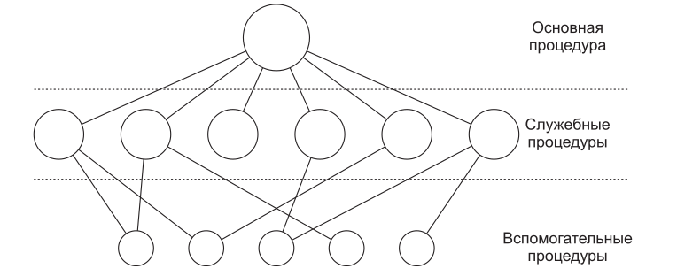

# Процесс загрузки системы

> **Обратите внимание!**
>
> В данной сстатье будет пропущена информация о процессе загрузки самогО ПК -
> BIOS, UEFI и пр.

## Загрузчик

Задача загрузчика - инициализировать ядро Linux [в нашем случае]. В помощь ядру
обычно используется образ начальной загрузки: `initrd` или `initramfs`,
представляющий собой архив с образом файловой системы, разворачивающийся в ОЗУ в
начале загрузки. В `initrd`/`initramfs` находятся нужные драйверы, скрипты и
прочее, что необходимо для инициализации оборудования и прочих целей.

## Ядро

После этого загружается ядро. Находится в `/boot`, в своём названии имеет
`vmlinuz`:

- `vm` - поддержка виртуальной памяти;
- `linu`;
- `z` - указывает на то, что файл сжат (формат сжатия, как правило, zlib, однако
  можно встретить LZMA, BZIP2 и пр.).

> **Обратите внимание!**
>
> Ядро Linux является _монолитным_.

### Монолитные ядра

Такая организация ядра является самой распространённой. Здесь всё ядро
представлена единой программой - оно написано в виде набора процедур, связанных
вместе в один большой исполняемый файл. При использовании этого решения каждая
процедура может свободно вызвать любую другую процедуру, если та выполняет
какое-либо полезное действие, в котором нуждается первая процедура. Наличие
нескольких тысяч таких процедур нередко приводит к громоздкой и непонятной
системе.



<small>Очень примерное строение монолитного ядра; Э.Таненбаум, "Современные
операционные системы"</small>

### Плюсы монолитного ядра

- Более прямой доступ к аппаратным средствам.
- Проще обмен данными между процессами.
- Процессы реагируют быстрее.

### Минусы монолитного ядра

- Большой размер.
- Требует больше ресурсов ПК.
- Менее безопасно.
- Все функции работают в одном адресном пространстве.

### Особенности ядра Linux

У ядра Linux есть достоинство - это модули ядра. Подключать новые модули можно
буквально на лету:

```
# modprobe MODULE_NAME
```

Предположим ситуацию. Вы подключили к компьютеру какое-то новое оборудование, а
его поддержки в монолитном ядре нет. В итоге вам потребуется пересобрать ядро.
Это может быть достаточно долгим и утомительным процессом. Поэтому, в случае
ядра Linux, вы просто подключите нужный модуль.

## Система инициализации

После ядра стартует `init` - подсистема инициализации в UNIX-системах, которая
запускает все остальные процессы и демоны. Имеет PID = 1. Раньше де-факто
стандартным инитом в GNU/Linux был SysVInit. Однако в самом начале 10-х годов
были попытки заменить его на что-то более удобное, простое и быстрое. В итоге
компания Canoni**cal** представила `upstart`, а в Gentoo появился OpenRC. Но
настоящую популярность завоевал `systemd` от компании Red Hat, на который
перешло большинство дистрибутивов GNU/Linux.

### Достоинства systemd

- Сервисы запускаются параллельно, в результате чего вся система запускается
  быстрее.
- Возможность запуска сервисов по умолчанию.
- Работа с логами - `journald`.
- Простой и лаконичный синтаксис служб.
- Удобный контроль над службами.
- Анализ времени загрузки служб и всей системы в целом.

### Недостатки systemd

- Сложная и монолитная система, заменяющая собой систему инициализации,
  планировщик, менеджер сети, пр.
- Достаточно тяжеловесная система по сравнению с другими инитами.
- Достаточно токсичный автор, вводящий в systemd много ненужного кала или
  удаляющий какие-либо кажущиеся ему ненужными функции.

---

**TODO**

- [ ] Добавить информацию о загрузке оболочки системы;
- [ ] Добавить информацию о DM;

---
