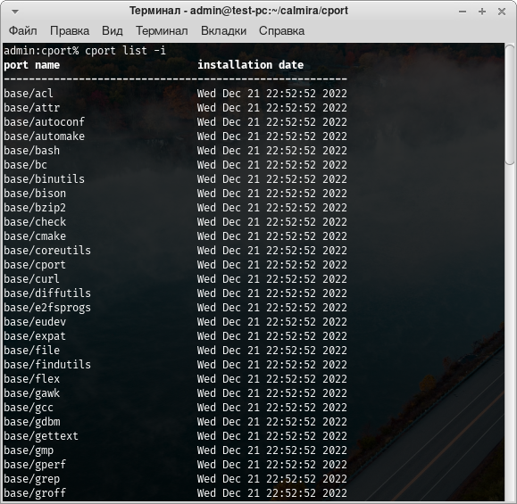

# Управление программным обеспечением

---

**TODO**

- [ ] Зависимости
- [x] Установка по
- [x] Удаление по
- [ ] Обновление по
- [ ] Обновление системы портов
- [x] Просмотр информации о ПО
- [x] Список портов

---

Всё программное обеспечение в Calmira GNU/Linux-libre собирается из исходного
кода. Для многих людей это достаточно сложный и утомительный процесс, поэтому в
системе присутствует средство для автоматизации этого процесса: система портов и
программа, которая с ней взаимодействует.

> Эта вещь называется "системой портов" потому, что она может функционировать на
> различных архитектурах процессора.

## Система портов

Система портов представляет собой набор файлов в `/usr/ports`. В этой директории
существует ряд поддиректорий, которые являются категориями ПО, сортирующее это
ПО по предназначению. К примеру, поддиректория `base/` содержит в себе все
системные порты, поддиректория `editors/` содержит в себе порты текстовых
редакторов.

В категориях расположены ещё одни поддиректории - это либо каталоги с самими
портами (имя каталога = имя порта), либо подкатегории. Например, подкатегория
`base/efi` содержит в себе порты для обеспечения корректной загрузки системы на
UEFI.

**Как различать каталог с портом от каталога с подкатегорией портов?** Очень
просто. В подкатегориях содержатся ещё одни каталоги, в которых расположены
порты, принадлежащие данной подкатегориию. В директории порта же находятся
текстовые файлы, основные из них: `install`, `port.toml` и `files.list`. Об их
предназначении далее.

### Строение порта

#### Нахождение порта в файловой системе

Порт - это директория в одной из (под)категорий в `/usr/ports`. Когда мы
называем имя порта, мы указываем его по следующему примеру: **`категория/имя`**.
Т.е. указываем путь до директории порта, опуская `/usr/ports`. Например, порт,
находящийся по адресу `/usr/ports/base/acl` в руководстве и прочей документации
будет указываться как `base/acl`. Тоже самое нужно указывать и при работе с
менеджером системы портов cport, речь о котором будет в следующей части этой
страницы.

#### Файлы в каталоге порта

Порт - это набор определённых файлов, содержащих сведения о портируемом ПО,
инструкции по сборке этого ПО из исходного кода и список файлов, которые этот
порт устанавливает в систему:

- `port.toml` - информация о портируемом ПО. Содержит сведения об имени пакета,
  его версии, краткое описание, информация о сборщике данного порта, список
  зависимостей и прочие подобные сведения.
- `install` - исполняемый BASH-скрипт, содержащий инструкции по сборке ПО из
  исходного кода.
- `files.list` - список файлов, которые будут установлены в систему этим портом.

Кроме того, есть ряд необязательных файлов:

- `README.md` - Markdown-файл, содержащий сведения из файла `port.toml`.
  Предназначен для формирования этой документации.
- `files/` - директория, содержащая дополнительные файлы порта, такие, как
  сторонние рекомендуемые конфигурационные файлы или патчи.
- `description` - файл с расширенным описанием порта (т.к. описание в
  `port.toml` ограничено 1й строкой, файл `description` может содержать
  произвольный объём информации).

> **Обратите внимание!**
>
> Глава 2 является вводной, поэтому здесь не будет расширенных сведений о
> системе портов и управлении программным обеспечением. Для получения
> дополнительных сведений см. [главу 3](./chapter_3_software.md).

## Менеджер системы портов `cport`

cport предназначен для управления системой портов. Без него СП - просто набор
ненужных никому файлов. cport же выполняет основные действия по работе с СП:
чтение конфигурационного файла порта, скачивание и распаковка архивов с исходным
кодом, исполнение сборочных инструкций порта и ведение локальной базы данных
установленного в систему ПО.

Без cport пользователю самостоятельно приходилось бы собирать и хранить сведения
об установленном в систему программном обеспечении, самостоятельно скачивать и
распаковывать архив с исходниками ПО, а также запускать сборочные инструкции ПО.
Данный метод не является безопасным, а cport выполняет множество проверок портов
и дистрибутива перед исполнением каких-либо действий.

Иначе говоря, cport автоматизирует рутинные действия пользователей и
администраторов, к тому же, избавляя их от выполнения проверок и тестов на
совместимость с дистрибутивом Calmira GNU/Linux-libre, например.

### Возможности `cport`

- Установка ПО
- Удаление ПО
- Сбор, хранение и просмотр информации о ПО
- Ведение локальной базы данных установленного в систему ПО
- Обслуживание системы портов (проверка на ошибки, поддержание её в актуальном
  состоянии)
- Обновление ПО до новой версии
- etc.

### Установка программного обеспечения

Для того, чтобы установить какой-либо порт, используется ключ `-i` (полная
версия: `--install`):

```
# cport -i PORT_NAME
```

<small>Вместо <tt><code>PORT_NAME</code></tt> подставьте имя нужного порта,
например, <tt><code>base/acl</code></tt>. Кроме того, вы можете указать
несколько портов. Они будут собраны в указанной вами последовательности.</small>

> **Обратите внимание!**
>
> cport не обрабатывает зависимости! Поэтому, если у программы есть зависимости,
> их вам нужно установить первыми, а уже потом собрать исходный порт.

Перед началом установки будет выведено следующее сообщение:

```
Selected ports:
	 llvm-15.0.1

How much space will be taken up on the disk: 3891.2 Mb

:: Continue? [Y/n] y
```

В секции `Selected ports` отображается список выбранных портов. Например, вы
устанавливаете порт `general/llvm` командой `cport -i general/llvm`. Вывод в
секции выбранных портов будет таким же, как в показано выше: отображается не имя
порта(ов), а имя пакета (указано в `port.toml` порта) и его версия (версия
указывается через дефис: `-`).

Далее показывается место, которое будет занято портом(портами) на диске.

После чего вас поприветствует приглашение к вводу ответа:

```
:: Continue? [Y/n]
```

Если вы согласны продолжить работу, введите `y` и нажмите <kbd>Enter</kbd>. В
противном случае введите `n` и нажмите <kbd>Enter</kbd>.

В том случае, если у порта есть какие-либо **необходимые** (**`required`**)
зависимости, которые не установлены в систему, вывод будет немного другим:

```
Selected ports:
	 xterm-370

Ports that are not installed on the system:
	 xorg/x11-minimal/xapps-0.1 xorg/x11-minimal/xcb-util-0.4.0 xorg/x11-minimal/xbitmaps-1.1.2 xorg/x11-minimal/mesa-21.3.6 general/libpng-1.6.37

How much space will be taken up on the disk: 836.2 Mb

:: Continue? [Y/n] y
```

Здесь появилась новая секция: `Ports that are not installed on the system`. В
том случае, если вы видите эту секцию со списком необходимых портов, прервите
сборку исходного порта и установите все недостающие зависимости из этого списка.
Только после их установки устанавливайте искомый порт.

После того, как вы ответили утвердительно (`y` + <kbd>Enter</kbd>) на вопрос о
продолжении сборки, cport начнёт скачивание и распаковку архива с исходным
кодом:

```
==> Download port 'editors/gvim'...
100% [....................................................] 15996348 / 15996348
[✓] Download OK
==> Validating source file with md5sums... Passed
==> Extracting 'editors/gvim'...
```

> **Обратите внимание!**
>
> При скачивании порта будет показываться прогресс операции.

После скачивания архива будет произведена проверка корректности скачивания. Для
этого сравниваются MD5-контрольные суммы и SHA256-контрольные суммы, указанные в
`port.toml` порта и вычесленные у скачанного файла.

В том случае, если ошибок нет, cport приступит к распаковке архива. После
распаковки он начнёт исполнение сборочных инструкций порта:

```
==> Building port 'editors/gvim'...
--== WARNING! ==--
Attention! It is not possible to build this package in multiple
threads, a single threaded build will be used.
configure: creating cache auto/config.cache
checking whether make sets $(MAKE)... yes
checking for gcc... gcc
checking whether the C compiler works... yes
checking for C compiler default output file name... a.out
checking for suffix of executables...
checking whether we are cross compiling... no

  ...
```

Первая строка (`Building port '...`) сигнализирует о том, что началось
исполнение сборочных инструкций порта. Все следующие за ней строки - это
информация, которую выводит файл `install` - наши сборочные инструкции. Эта
информация отображает прогресс выполнения и конкретные действия, которые
выполняются. В случае возникновения ошибки эта информация будет неплохим
средством для поиска причин возникновения неудачи и способа её решения.

> **Внимание!**
>
> В терминал выводится довольно много информации. Это нормально.

В том случае, если порт установлен корректно, в конце вы получите примерно
следующее сообщение:

```
[✓] Build OK!
==> Updating the database... OK
==> Checking the port 'general/llvm' for correct installation... [✓] Checking completed successfully
==> Clearing the cache...
[✓] 161 files was deleted!
```

Оно говорит вам о том, что:

1. Сборка завершена успешно.
2. В базу данных добавлена информация об установленном(ых) порте(ах).
3. Проверка на корректность установки порта(ов) завершилась без ошибок
   (проверяется наличие установленных в систему файлов).
4. Очищен кеш cport с файлами исходного кода и копиями установленных в систему
   файлов.

В том же случае, если во время сборки порта произошла ошибка, будет выведено
следующее сообщение:

```
[!] Build instructions was returned a value other then 0!
```

Оно означает, что работа сборочных инструкций завершилась с ошибкой. Если вы
видите это сообщение, то выше обязательно должна быть отображена причина.
Прочитайте вывод выше этого сообщения для поиска и устранения неисправности.

В случае ошибки не будут выполнены следующие действия:

1. Устанавливаемый порт не будет добавлен в базу данных.
2. Следовательно, не будет проверки на корректность установки порта.
3. Не будет очищен кеш - это сделано специально для того, чтобы пользователю
   были доступны все файлы исходного кода, логи и прочие подобные вещи, которые
   могут понадобиться для исправления ошибки.

> **Обратите внимание!**
>
> Распакованные файлы архива с исходным кодом порта содержатся в директории
> `/usr/src`. Все логи сборки и прочие файлы содержатся именно там. Но скачанные
> _архивы_ с исходным кодом ПО содержатся в директории
> `/var/cache/cport/downloads`.

### Удаление программного обеспечения

Для удаления используется ключ `-r` (`--remove`):

```
# cport -r PORT_NAME
```

МСП пройдётся по файлу `files.list` порта. Каждый файл, который указанный порт
устанавливает в систему, указывается на новой строке `files.list`. На основе
содержимого этого файла cport составляет список файлов. После чего проходится по
этому списку и удаляет из него те файлы, которые в системе отсутствуют. По
завершению этого процесса все существующие в системе файлы удаляются.

cport также спросит у вас продолжение работы:

```
========================= Removing port 'editors/gvim' =========================

:: Continue? [y/N]
```

> **Обратите внимание!**
>
> На данный момент cport **не** выводит информацию об удалении. Это скоро будет
> исправлено.

В случае согласия он приступит к удалению:

```
==> Remove the 'editors/gvim' files from the system...
==> System check...
==> Remove port 'editors/gvim' from database... OK
```

### Просмотр информации о ПО

Для того, чтобы просмотреть информацию о порте(ах) используется ключ `-I`
(`--info`):

```
# cport -I PORT_NAME
```

Будет прочитано содержимое файла `port.toml` указанного порта, после чего
результат парсинга будет выведен на экран:

```
==================== Information about port 'base/attr' ====================
Base information:
name        : attr
version     : 2.5.1
description : Commands for Manipulating Filesystem Extended Attributes.
maintainer  : Sergey Gaberer <nordic.dev@pm.me>
releases    : v2.0a1 v2.0a2 v2.0a3
priority    : system
usage       : 4.4
upgrade_mode: soft
build_time  : 0.1
installed   : True

Dependencies:
required    : base/libtool


```

В терминал будет выведена основная информация, взятая из файла `port.toml`:

- **name** - имя **программы** (а не порта - имя порта и так уже известно)
- **version** - версия порта/программы
- **description** - краткое описание порта
- **maintainer** - информация о создателе и/или сопровождающем порта
- **releases** - список релизов Calmira GNU/Linux-libre, с которыми совместим
  данный порт
- **priority** - приоритет порта (`system` - системный, `user` -
  пользовательский; системные порты нельзя удалять из системы во избежание
  ошибок в её работе)
- **usage** - сколько занимает место порт в файловой системе после установки (в
  мегабайтах)
- **upgrade_mode** - режим обновления (`soft` - порт просто переустанавливается,
  `hard` - все файлы порта удаляются, после чего устанавливается новая версия
  порта)
- **build_time** - примерное время сборки порта (в единицах, аналогичных SBU из
  руководства "Linux From Scratch")
- **installed** - установлен ли порт в систему (`True` - порт установлен,
  `False` - порт не установлен)

Далее идёт секция с описанием зависимостей порта:

- **required** - необходимые зависимости
- **recommend** - рекомендуемые зависимости
- **optional** - опциональные зависимости

> **Обратите внимание!**
>
> Какого-то из пункта с описанием типов зависимостей в выводе может и не быть
> (ровным счётом как и у ПО может не быть определённого типа зависимостей).
> Иногда возникают такие ситуации, когда секция `Dependencies` вообще пуста -
> ничего страшного или необычного в этом нет.

### Просмотр списка портов

cport позволяет выводить и список всех портов, которые присутствуют в СП. Это
нужно, к примеру, для поиска нужного ПО, либо для просмотра всех портов, которые
установлены в системе. Для просмотра списка портов используется опция `list`.

В том случае, если она передаётся МСП **без** указания дополнительных
аргументов, будет выведен неформатированный список всех портов в СП:

```
% cport list
base/acl
base/attr
base/autoconf
base/automake
base/bash
general/vagina
general/valgrind
general/wf-recorder
general/which_orig
general/which_script
general/wl-clipboard
general/wlr-randr
general/wofi
net/curl
net/libpsl
net/links
net/lynx
postcpl/btrfs-progs
postcpl/cracklib
postcpl/dosfstools
postcpl/fuse

  ...
```

Далее, вы можете передавать опции `list` дополнительные ключи:

- `-a` - форматированный вывод всех портов;
- `-i` - вывод только установленных в систему портов;
- `-I` - вывод только **НЕ** установленных в систему портов;
- `-b` - вывод портов с ошибками (отсутствует какой-то файл, либо статус порта
  (установлен/не установлен) определить невозможно).

#### Форматированный вывод всех портов

Вывод поделён на две колонки: первая колонка состоит из одного символа, который
символизирует статус порта. Вторая колонка (напротив первой) - имя порта.

- Если первая колонка зелёного цвета - порт установлен в систему.
- Если первая колонка серого цвета - порт **не** установлен.
- Если первая колонка красного цвета - порт с ошибкой.


#### Вывод только установленных в систему портов

Вывод поделён на две колонки: в первой колонке имя порта, во второй - дата его
установки в систему, либо дата его добавления в базу данных установленного ПО.
Иногда возникают ситуации, когда необходимо пересобрать базу данных, в
результате чего информация о дате установки портов может потеряться, в
результате чего она заменяется информацией о времени добавления порта в БД.



#### Вывод только НЕ установленных в систему портов

Здесь просто выводится список не установленных в систему портов.


